# Architecture

Generated once by gitdiagram, then corrected against the code. It was wrong in
one way that mattered — it showed `expenses.js` handling income and savings,
which are separate route files — and it left out the read cache, the contexts
and four routes entirely.

Kept deliberately incomplete: this is the shape of the system, not an
inventory. Individual screens and form components are grouped rather than
listed, because a diagram with all 22 screens on it is a picture nobody reads.
The code is the inventory.

```mermaid
flowchart TD

user(("Household user"))

subgraph mobile["Mobile app — Expo / React Native"]
  app["App providers + error boundary<br/>[App.js, ErrorBoundary.js]"]
  nav["Tabs and stacks<br/>[RootNavigator.js]"]

  subgraph screens["Screens"]
    calendar["Calendar and agenda<br/>[CalendarScreen.js, AgendaScreen.js]"]
    finance["Finances and forms<br/>[FinancesScreen.js, ExpenseFormScreen.js, IncomeFormScreen.js]"]
    savingsUi["Savings<br/>[SavingsScreen.js, SavingsFormScreen.js]"]
    stats["Statistics<br/>[StatsScreen.js, ExpenseStatsScreen.js]"]
    lists["Wish list and to-do<br/>[WishlistScreen.js, WishlistFolderScreen.js]"]
    settings["Settings and household<br/>[SettingsScreen.js, HouseholdScreen.js]"]
  end

  subgraph state["Shared state — React contexts"]
    auth["Session<br/>[AuthContext.js]"]
    prefs["Language, theme, currency<br/>[SettingsContext.js, ThemeContext.js]"]
    cache["Optimistic caches<br/>[CategoriesContext.js, WishlistItemsContext.js]"]
    events["Write announcements<br/>[DataEventsContext.js]"]
    queue["Offline write queue<br/>[OfflineQueueContext.js]"]
    notif["Reminders<br/>[NotificationsContext.js]"]
  end

  reads["Cached reads<br/>[cachedGet.js]"]
  client["HTTP + JWT client<br/>[client.js]"]
  toast["Toasts, undo, banners<br/>[Toast.js]"]
end

subgraph api["Backend API — Express + Mongoose"]
  server["Startup<br/>[server.js]"]
  dispatch["Middleware and mounts<br/>[app.js]"]
  rAuth["/api/auth<br/>[auth.js]"]
  rExpenses["/api/expenses<br/>[expenses.js]"]
  rIncome["/api/income<br/>[income.js]"]
  rSavings["/api/savings<br/>[savings.js]"]
  rEvents["/api/events<br/>[events.js]"]
  rStats["/api/stats<br/>[stats.js]"]
  rWishlist["/api/wishlist<br/>[wishlist.js]"]
  rCategories["/api/categories<br/>[categories.js]"]
  rHouseholds["/api/households<br/>[households.js]"]
  rNotif["/api/notifications<br/>[notifications.js]"]
  rPush["/api/push-token<br/>[pushToken.js]"]
  rAudit["/api/audit-log<br/>[auditLog.js]"]
end

subgraph data["Domain data"]
  mUser[("User.js")]
  mHousehold[("Household.js")]
  mExpense[("Expense.js")]
  mIncome[("Income.js")]
  mSavings[("Savings.js")]
  mEvent[("Event.js")]
  mWishlist[("WishlistItem.js")]
  mCategory[("Category.js")]
  mAudit[("AuditLog.js")]
end

mongo[("MongoDB Atlas")]
sentry["Sentry"]

user -->|"uses"| nav
app -->|"renders"| nav
app -->|"provides"| state
nav --> calendar & finance & savingsUi & stats & lists & settings

screens -->|"read and write through"| state
screens -->|"read through"| reads
state -->|"write through"| client
state -->|"confirm through"| toast
reads -->|"on success, caches; offline, serves last copy"| client
client -->|"write with no response"| queue
queue -->|"retries later"| client

client -->|"HTTPS + JWT"| dispatch
server -->|"starts"| dispatch
dispatch --> rAuth & rExpenses & rIncome & rSavings & rEvents & rStats
dispatch --> rWishlist & rCategories & rHouseholds & rNotif & rPush & rAudit

rAuth --> mUser
rHouseholds --> mHousehold & mUser
rExpenses --> mExpense
rIncome --> mIncome
rSavings --> mSavings
rEvents --> mEvent
rWishlist --> mWishlist
rCategories --> mCategory
rStats -.->|"reads"| mExpense
rAudit --> mAudit

mUser & mHousehold & mExpense & mIncome & mSavings & mEvent & mWishlist & mCategory & mAudit -->|"persist"| mongo

app -.->|"crashes and handled errors"| sentry
dispatch -.->|"server errors"| sentry

classDef blue fill:#dbeafe,stroke:#2563eb,color:#172554
classDef amber fill:#fef3c7,stroke:#d97706,color:#78350f
classDef mint fill:#dcfce7,stroke:#16a34a,color:#14532d
classDef rose fill:#ffe4e6,stroke:#e11d48,color:#881337
class app,nav,calendar,finance,savingsUi,stats,lists,settings,auth,prefs,cache,events,queue,notif,reads,client,toast,user blue
class server,dispatch,rAuth,rExpenses,rIncome,rSavings,rEvents,rStats,rWishlist,rCategories,rHouseholds,rNotif,rPush,rAudit amber
class mUser,mHousehold,mExpense,mIncome,mSavings,mEvent,mWishlist,mCategory,mAudit,mongo mint
class sentry rose
```

## What the picture does not show

**Household isolation.** Every route resolves the caller's household from the
JWT and scopes its query to it. It is the security boundary that matters most
and it lives inside each route rather than as a box of its own.

**Why reads and writes take different paths.** A read goes through
`cachedGet.js`, which stores every successful response and serves the last one
when there is no reply — labelled stale, never in answer to a 401 or 404. A
write goes straight out through `client.js`, and if it gets no response it
lands in the offline queue and is retried. The screen has already been updated
optimistically by then, which is why nothing appears to wait.

**Delivery.** JavaScript changes reach the phones over EAS Update on the
`preview` channel; anything native needs a new build. See
`.claude/skills/ship-update/SKILL.md`.
