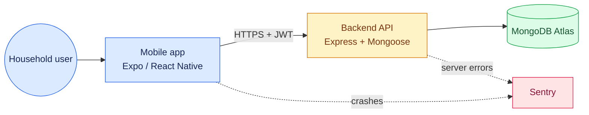
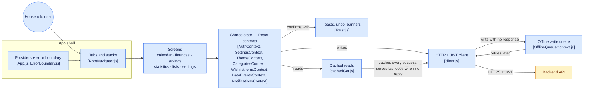
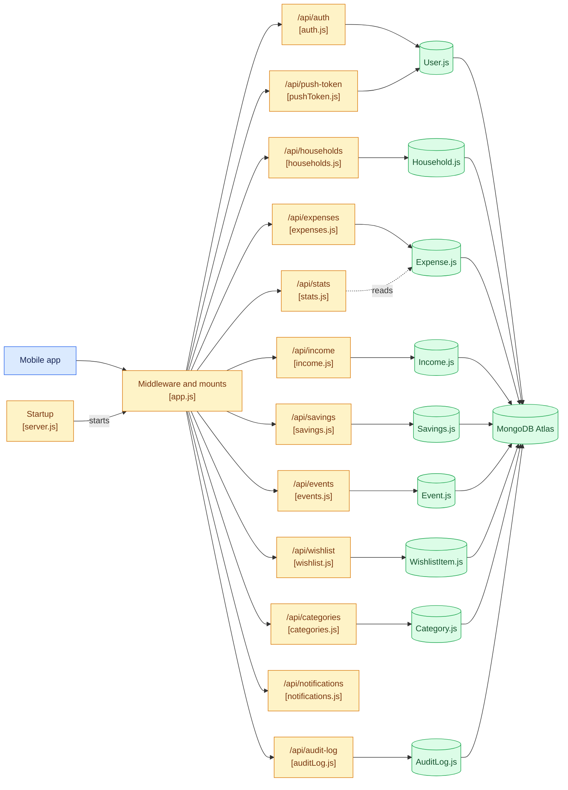

# Architecture

Three diagrams instead of one. A single picture of the whole system renders as
a band too wide to read — Mermaid places two connected groups side by side and
stretches the edges between them across the canvas. Each of these fits on a
screen and answers one question.

The first one was generated by gitdiagram and corrected against the code: it
had `expenses.js` handling income and savings, which are separate routes, and
it left out the read cache, the contexts and four of the twelve routes.

## The system at a glance

## How the app talks to the server

The part worth understanding: **reads and writes take different paths**, and
that is what makes the app usable with no connection.

A write updates the screen first and is only then sent. If it cannot reach the
server it goes into the queue and is retried, and it is **not** rolled back —
the `err.queued` flag says so. A read serves the last good copy when there is
no reply, labelled stale, but never in answer to a 401 or a 404: that is the
server answering, and old data would be a lie.

## The API and what it owns

## What the pictures cannot show

**Household isolation.** Every route resolves the caller's household from the
JWT and scopes its query to it. It is the security boundary that matters most,
and it lives inside each route rather than as a box of its own — which is
exactly why the backend tests spend most of their effort on it.

**Screens are grouped, not listed.** There are 22 of them under
`mobile/src/screens`. A diagram carrying all 22 is a picture nobody reads; the
code is the inventory, this is the shape.

**Delivery.** JavaScript changes reach the phones over EAS Update on the
`preview` channel; anything native needs a new build. See
`.claude/skills/ship-update/SKILL.md`.
